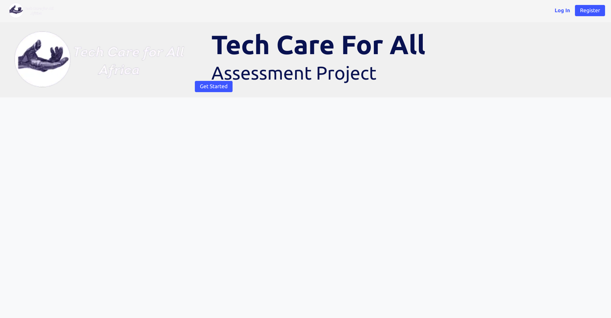
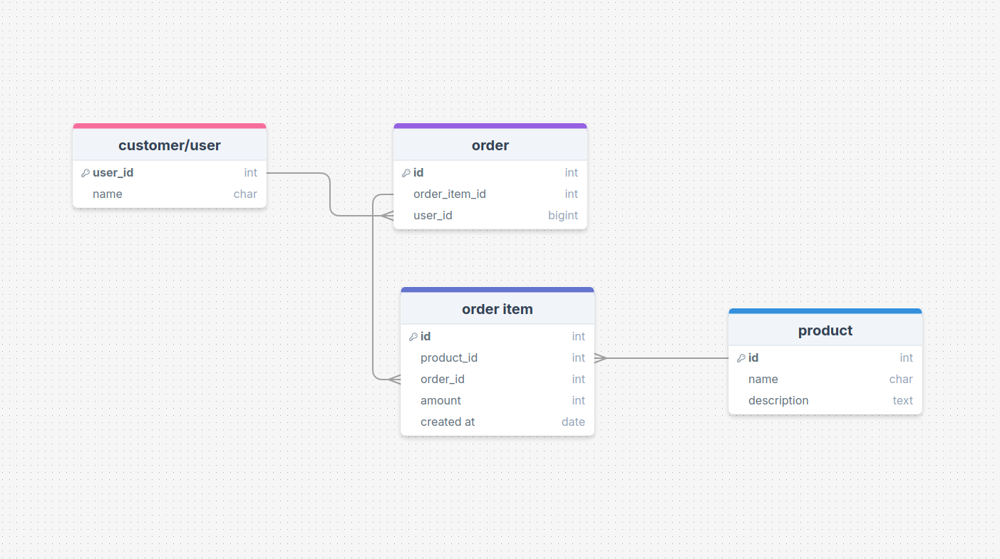

# Tech Care For All Africa 

Assesment task for TC4A




## Tech Stack

- **Backend**: Django/Django REST Framework
- **Frontend**: React
- **Database**: SQLite
- **Authentication**: OpenID Connect using google 
- **SMS Gateway**: Tiara Connect
- **Testing**: Django Test Suite
- **CI/CD**: GitHub Actions

## Project Structure

```
├── backend/
│   └── ...
├── frontend/
│   └── ...
├── .github/
│   └── workflows/Backend.yml
└── README.md

```

## Database Schema



### Users
- id (Primary Key)
- name (VARCHAR)

### Products
- id (Primary Key)
- name (VARCHAR)
- description (TEXT)

### Orders
- id (Primary Key)
- user_id (Foreign Key)
- created_at (TIMESTAMP)

### Order Items
- id (Primary Key)
- order_id (Foreign Key)
- product_id (Foreign Key)
- amount (DECIMAL)
- created_at (TIMESTAMP)

## API Endpoints

### Authentication
- `POST /api/token/` - Get JWT token
- `POST /api/token/refresh/` - Refresh JWT token

### Products
- `GET /api/products_list/` - List all products
- `POST /api/crreate_product/` - Create a product
- `DELETE /api/delete_product/{id}/` - Delete a product

### Orders
- `GET /api/order_list/` - List user's orders
- `POST /api/add_to_product_to_cart/{id}/` - Add product to cart
- `DELETE /api/delete_order_item/{id}/` - Delete order item

### SMS 
- `POST /api/send_sms/` - Send checkout SMS


## Getting Started

1. Clone the repository:
```bash
git clone https://github.com/AmosMaru/tech-care-for-all-africa.git
cd tech-care-for-all-africa
```

2. Install backend dependencies:
```bash
cd backend
pip install -r requirements.txt
```

3. Run migrations:
```bash
python manage.py makemigrations
python manage.py migrate
```

4. Create a `.env` file:
```
SMS_URL=your_africas_talking_url
SMS_API_KEY=your_api_key
SMS_FROM=your_sender_id
```

5. Run the development server:
```bash
python manage.py runserver
```

6. Install frontend dependencies:
```bash
cd ../frontend
npm install
```

7. Start the frontend development server:
```bash
npm run dev
```

## Testing

### Backend Tests
```bash
cd backend
python manage.py test
```

## CI/CD

The project uses GitHub Actions for CI/CD:

- Runs tests on every push and pull request
- Automated on merge to main branch
